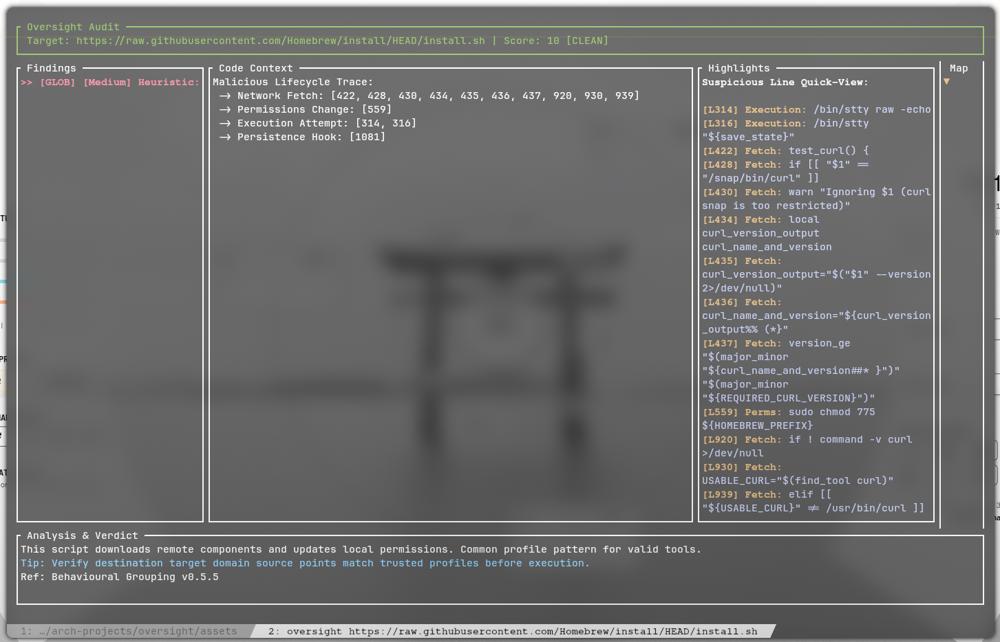
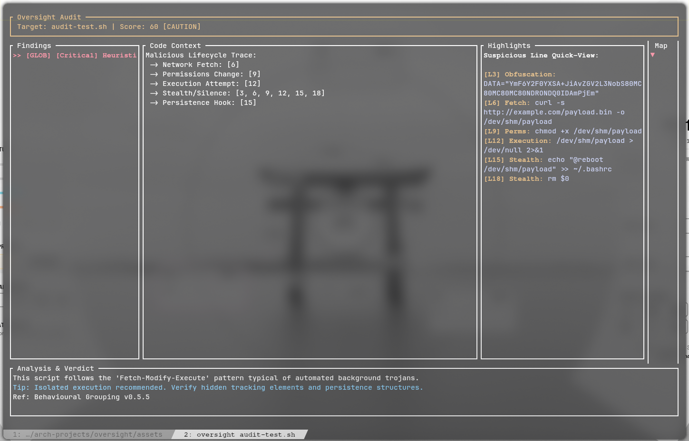

# Oversight (v0.5.6)

[](https://github.com/Rakosn1cek/oversight)
[](https://discord.gg/cv3ZEYK5Na)


Oversight is a terminal-based security intelligence tool designed to audit shell scripts and commands before they touch your system. It bridges the gap between "blind trust" and "manual auditing" by providing a high-speed, interactive analysis of both local files and remote scripts via Raw URLs.

## Oversight

https://github.com/user-attachments/assets/db958f2a-1927-4b19-a477-d31b959332e3

**Live AUR Update**
 
https://github.com/user-attachments/assets/fe91df7c-8d44-4314-a9c3-aa054bfd9d73

! [Oversight Video](assets/oversight.mp4)

## Screenshot 1



## Screenshot 2



## The Mission
Most system compromises happen because of a leap of faith, such as executing an unverified package upgrade or running raw setup scripts. Oversight gives you clear insight into these buffers, flagging malicious patterns and explaining security risks in plain language so you can make an informed decision before confirming installations.

## Features
* **Dynamic Multi-Stream Tab Layout**: Automatically parses unified git stream headers on the fly. When a batch update drops, it isolates the combined patch stream and generates dedicated, readable tabs for each package, pulling in and auditing accompanying `.install` scripts and `.patch` files from the local build directory.
* **Heuristic Entropy Engine**: Implementation of Shannon entropy calculations to identify obfuscated payloads, packed data, and hidden strings that traditional regex scanners miss.
* **Malicious Lifecycle Tracking**: Advanced behavioural analysis that links related events across a script, such as the Fetch -> Permissions Change -> Execution chain typical of trojan installers.
* **Security Heat Map Sidebar**: A vertical track providing a real-time visual overview of threat distribution across the active file, ensuring exact coordinate indicators scale accurately for every distinct tab buffer.
* **Anti-Forensic & Persistence Detection**: Monitoring for stealth behaviours including self-deletion (`rm $0`), silent pipelines (`> /dev/null`), RAM-only execution paths (`/dev/shm`), and reload hooks (`crontab`, `systemctl`).
* **Weighted Risk Scoring**: Implements a 0 to 100 safety index that categorises streams as Clean, Caution, or Dangerous based on flat macro metrics that avoid risk-score bloat.
* **Global Mitigation Toggle**: Allows users to instantly suppress active findings via the TUI using a single switch. This visually sanitises the view by commenting out flagged blocks and recalculates the global risk score index in real time.
* **Clean Stream Pager Mode**: Removes empty viewport blocks. When a stream passes analysis with zero flags, the full terminal layout remains open as a functional pager, allowing for a standard line-by-line manual code review.
* **Dynamic Rules Engine**: Patterns are externalised in an independent rules module, allowing for modular updates across different pattern signatures without breaking the TUI parsing loop.
* **Remote Fetching Engine**: Audit scripts directly from GitHub, Gist, or raw URLs securely via memory-only analysis.
* **Educational Auditing**: Every security flag includes a detailed explanation and external references to help users learn to identify malicious scripting patterns.
* **Vulnerability Intelligence**: Integrated real-time scanning for known CVEs using the OSV.dev API, triggering automatically when supported package installation commands are detected.

---

## Dependencies
Oversight is built in Rust for performance and binary isolation. The following native components are required for compilation:
- **Rust Toolchain:** `cargo` and `rustc` (Edition 2021) to compile the native engine.
- **OpenSSL:** System library required by `reqwest` for establishing secure remote TLS/SSL fetching operations.
- **Core Crates:** `ratatui`, `crossterm`, `tokio`, `reqwest`, `clap`, and `regex`.

---

## Installation & Setup

1. Via AUR (Recommended for Arch Linux)
The stable release is maintained on the AUR. Install it using your preferred helper:

`yay -S oversight-git`

2. **Or build manually**:

```zsh
git clone [https://aur.archlinux.org/oversight-git.git](https://aur.archlinux.org/oversight-git.git)
cd oversight-git
makepkg -si
```

3. **From source:**

`git clone https://github.com/Rakosn1cek/oversight.git` 
`cd oversight`

4. **Run the Automated Installer:**
The installer handles compilation, moves the binary to `~/.local/bin`, and injects the necessary hooks into your shell configuration (.zshrc, .bashrc, or config.fish).

```zsh
chmod +x install.sh
./install.sh
```
4. **Reload your shell:**

`source ~/.zshrc` or your respective shell config

---

## Files & Locations
- **Binary**: ~/.local/bin/oversight
- **Rules Database**: ~/.local/share/oversight/rules.json (Respects $XDG_DATA_HOME)
- **Shell Hooks**: ~/.local/share/oversight/oversight.[zsh|bash|fish]

---

## Usage
- **Audit a local script**: `oversight ./install.sh`
- **Audit a remote URL**: `oversight https://raw.githubusercontent.com/...`
- **Audit a local configuration file**: `oversight ~/.local/share/oversight/rules.json`
- **Live Protection**: Intercepts standalone commands like `curl https://...` or risky patterns like `rm -rf /` automatically to offer a multi-option triage menu, and deeply inspects downstream AUR cache profiles before execution.

---

## Shell Configuration Integration
To permanently deploy Oversight as your primary text and upgrade pager, append either configuration rule to your shell profile file (e.g., `~/.zshrc`, `~/.bashrc`, or `~/.config/fish/config.fish`):

### Option A: Dedicated AUR Helper Integration (Targeted)
Forces your helper to use Oversight specifically for package upgrades without affecting other system commands:

**For yay (~/.zshrc or ~/.bashrc)**:
`alias yay="yay --diffpager oversight"`

**For paru (~/.config/paru/paru.conf)**:
Uncomment or add the pager rule inside the options block:

```zsh
[options]
Pager = oversight
```

## Option B: Global System Pager Environment (Universal)
Registers the engine as your absolute default shell text pager. Packages, manuals (man), and git streams will automatically pass through the interface:

**Append to ~/.zshrc or ~/.bashrc**

- `export PAGER="oversight"`
**!Required if MANPAGER is already set to 'less' or another pager**
- `export MANPAGER="oversight"`

---

## Global Pager Side-Effects Reference

When deploying Oversight globally by exporting it as the primary system text viewer (`export PAGER="oversight"`), the engine intercepts all data streams that pass through terminal paging mechanics.

- While the system handles these inputs safely, the following behavioral traits will manifest across your daily terminal operations:
- **Official Repository Updates (pacman Sync)**: Running a full system upgrade via `yay` processes official repository mirrors before reaching the AUR queue. Because official binaries lack Git structural paths or cache scripts, Oversight automatically falls back to a flat text buffer. The interface renders the single Static Analysis Passed finding row, immediately mapping your arrow keys to vertically scroll the text transaction list line by line like a standard text pager.
- **System Manuals (man pages)**: Reviewing command references (e.g., `man pacman` or `man yay`) redirects the instruction manuals directly through the engine. The text parses as a clean stream, allowing you to use standard viewport hotkeys to review documentation inside the unified TUI frame.
- **Git Repository Telemetry**: Core commands such as `git log` or `git diff` inside your local repositories pass through the static rules database. If a commit contains a matching signature pattern, it triggers the engine alerts; otherwise, it presents standard code reviews within the main pane cleanly.
- **Automatic Layout Scaling**: The internal parsing logic relies on strict unified header hooks (`diff --git a/.*/yay/`) to allocate multiple package tabs. If an incoming stream does not contain these specific tokens (like normal manuals or repository mirrors), the multi-tab layout is bypassed entirely to prevent terminal workspace fragmentation.

---

**Keybinds**:
- **Up / Down Arrow Keys**: Navigate through the findings items on the left panel at all times, ensuring the list selection is never trapped.
- **PageUp / PageDown Keys**: Smoothly scroll the central code viewport line by line independently of the list selection.
- **Tab Key**: Cycle focus forward through the active code stream segments, jumping from the combined patch stream directly into the individual PKGBUILD source tabs.
- **Numeric Keys (0-9)**: Jump directly to a specific tab index layout instantly.
- **Left Arrow Key**: Instantly reset the viewport vertical scroll coordinate offsets back to the top.
- **[S] Key**: Toggle global suppression to instantly comment out flagged code blocks across the active selection block and re-balance risk parameters in one pass.
- **[Q] or Esc**: Safely close the interface and pass execution control back to the terminal process pipeline.

---

> *Note: Oversight is an advisory tool. While it uses robust regex pattern matching, no security tool is 100% bulletproof. Always use the "Final Verdict" as a guide and review the highlighted code manually if you are unsure about a source.*

> *Note2: Oversight is still in active development; therefore, no guarantee is provided regarding its functionality or system impact at this stage.*

## Support & Contributions
If you would like to support or contribute to the project you are more than welcome.

If you would like to discuss or ask questions about Oversight please join my **Discord server [Rakosn1cek](https://discord.gg/cv3ZEYK5Na)**

## License
MIT © 2026 Rakosn1cek. Attribution is required for any redistribution or derivative works.
 
